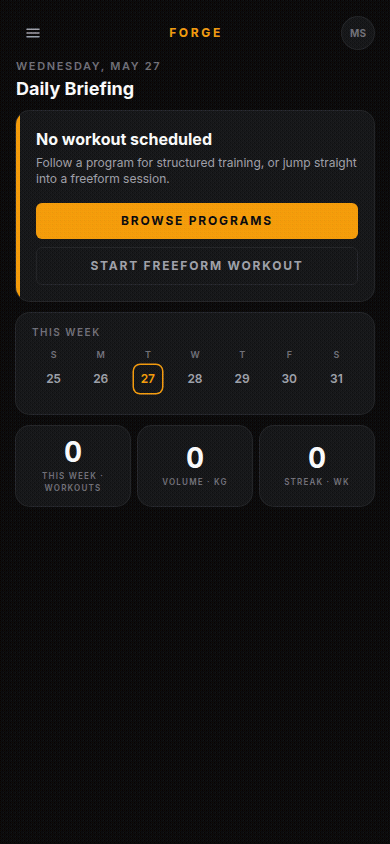

# Forge

Self-hosted workout tracker and planner for one user. Log workouts fast, build reusable routines, assemble them into multi-week programs.



## Stack

Bun · Hono · SQLite (Drizzle) · Vite · React · Tailwind v4 · Dexie (offline) · PWA

Full rationale in [docs/decisions/0004-tech-stack.md](docs/decisions/0004-tech-stack.md).

## Features

- **Exercise library** — create, edit, search exercises with muscle groups, equipment, and video links
- **Routine builder** — ordered blocks of single exercises or supersets, drag-to-reorder
- **Programs** — multi-week plans assembled from routines
- **Goals** — personal goal tracking
- **Workout logging** — active workout session tracker with history
- **Settings** — unit preferences and app configuration
- **REST API** — stable API for scripting and external tooling
- **PWA** — mobile-first, installable, works offline

## Dev

```bash
bun install
mkdir -p data
bun run db:generate        # when schema changes
bun run db:migrate         # apply migrations
bun run dev                # server on :8080, vite on :5173
```

Visit `http://localhost:5173`.

## Build & run

```bash
bun run build
bun run start              # serves SPA + API from :8080
```

## Docker

```bash
docker build -t forge:latest .
docker run -v forge-data:/data -p 8080:8080 -e FORGE_TOKEN=secret forge:latest
```

## Unraid

Import `unraid/forge.xml` as a Community Applications template.

## Environment variables

| Variable | Description |
|---|---|
| `FORGE_TOKEN` | Bearer token for API authentication |

## Testing

```bash
bun run test               # unit tests (vitest)
bun run test:e2e           # end-to-end tests (playwright)
bun run typecheck          # TypeScript check
bun run db:studio          # Drizzle Studio (database browser)
```

## Layout

```
src/
  client/       React app (Vite root)
    pages/      exercises, routines, programs, goals, workout, history, settings
  server/       Hono server + API routes
  db/           Drizzle schema + migrations
  shared/       Types shared across client & server
docs/
  PRD.md
  decisions/    Architectural / product decisions
design/         Stitch-generated mockups (visual reference)
specs/          Feature specs
unraid/         Unraid Community Applications template
```
